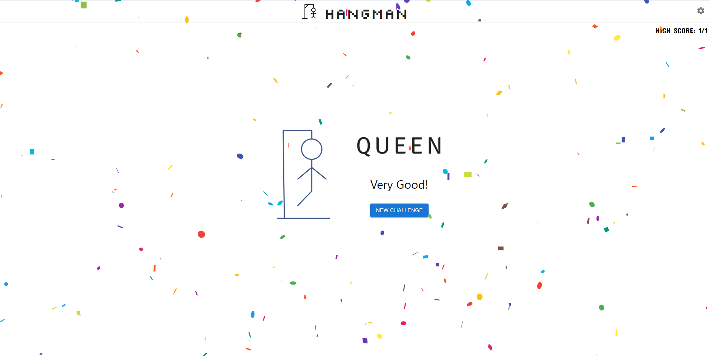

# Hangman
[Hangman](https://bensondavis.github.io/hangman/) is an old school favorite, a word game where the goal is simply to find the missing word or words.

You will be presented with a number of blank spaces representing the missing letters you need to find.

Initially a letter is randomly revealed to help you with the start.

#### Use the **keyboard** to guess a letter.
>

#### Every time you guess a letter wrong you loose a life and the **hangman** begins to appear, piece by piece.
> 

If your chosen letter exists in the answer, then all places in the answer where that letter appear will be revealed.

#### You will win the game if you could guess the word with the given number of chances.
>

Solve the puzzle before the hangman dies.
